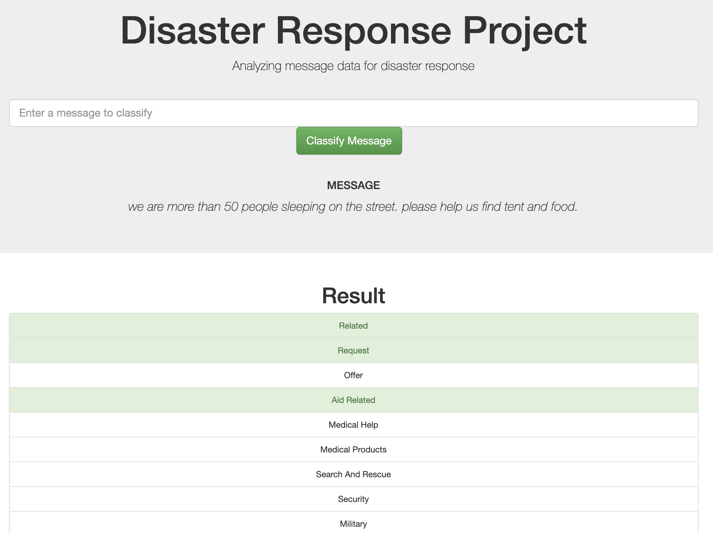
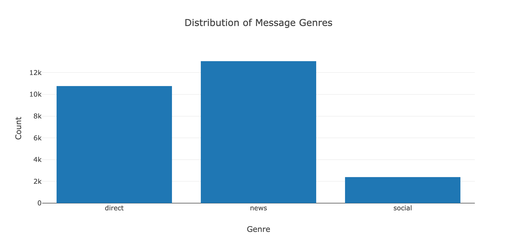
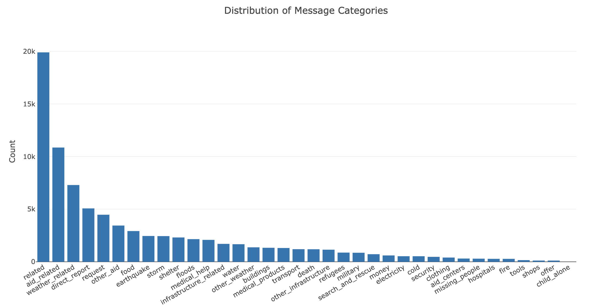
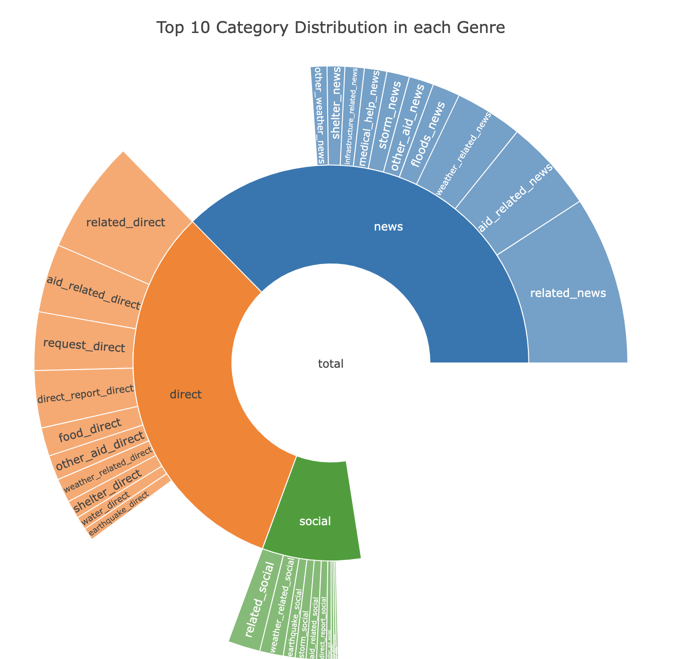
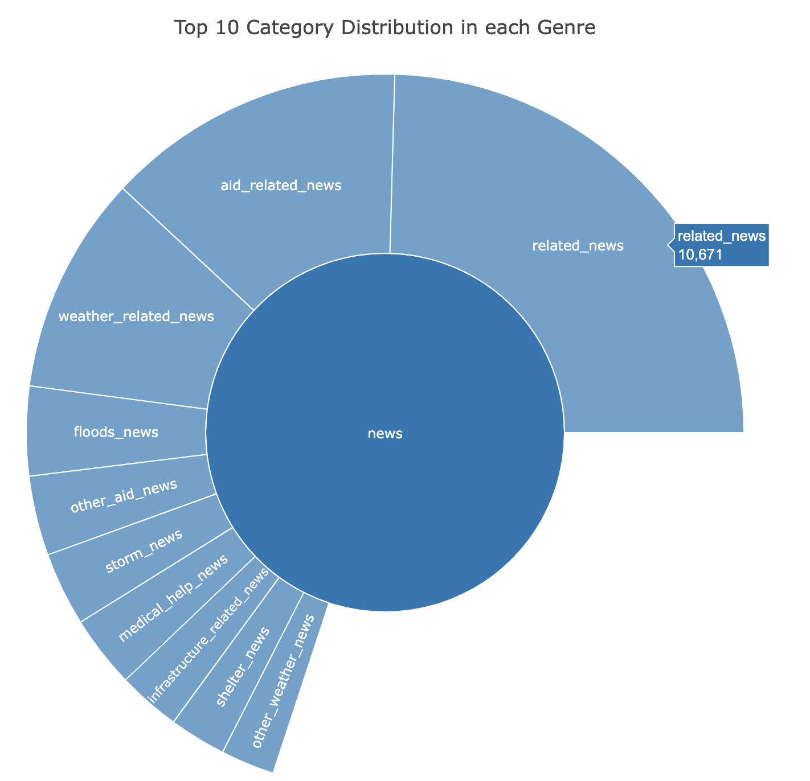

# Disaster Response Pipeline Project
- [Project Overview](#Project-Overview)
- [Installation](#Installation)
- [Project Structure](#Project-Structure)
- [Project Components](#Project-Components)
- [Instructions](#Instructions)

## Project Overview<a name="Project-Overview"></a>
The **Disaster Response Pipeline Proejct** is a part of the Udacity Data Science Nanodegree Program in collaboration with Figure Eight who provides a large number of pre-labelled tweets and text messages from real life disasters. The Figure Eight is hoping to use this project to help disaster response organisations to respond disaster strikes more proactively and efficiently.

Therefore, the project's target is aiming to build a ETL Pipeline to manipulate datasets and then use a Machine Learning Pipeline to build a supervised learning model and extract informative messages from the text. In addition, a webpage app which can be used to investigate the trends and keywords related to different category of disasters will be generated as the objectives. Details on the project are discussed below.

## Installation<a name="Installation"></a>
The following packages and versions are used in this jupyter notebook. Any recent versions should work. 
`Note: Updating your packages before executing the project is recommended!`

| Package  | Version |
| ------------- | ------------- |
| Python  | 3.6.3  |
| Pandas  | 0.23.3  |
| Numpy   | 1.12.1 |
| sqlalchemy | 1.2.19|
| nltk    | 3.2.5|
| scikit-learn  | 1.0.1|
| pickle  | 1.6.0|
| Flask   | 0.12.5|
| plotly  | 5.3.1|


## Project Structure<a name="Project-Structure"></a>
├── app
│   ├── run.py--------------------------------# Flask file that runs app
│   └── templates
│       ├── go.html---------------------------# classification result page of web app
│       └── master.html-----------------------# main page of web app
├── data
│   ├── DisasterResponse.db-------------------# database to save cleansed data
│   ├── disaster_categories.csv---------------# data to process 
│   ├── disaster_messages.csv-----------------# data to process 
│   ├── process_data.py-----------------------# ETL pipeline codes
|   └── ETL Pipeline Preparation_NP.ipynb-----# jupyter notebook with details and tests for ETL pipeline
├── img
├── models
|   ├── train_classifier.py-------------------# ML pipeline codes
│   ├── ML Pipeline Preparation_NP.ipynb------# jupyter notebook with details and tests for ML pipeline
|   └── classifier.pkl------------------------# saved model

## Project Components<a name="Project-Components"></a>
There are 3 main components in this project.

### 1. ETL Pipeline
- loads the 'disaster_messages.csv' and 'disaster_categories.csv' datasets
- merges the two datasets
- cleans the data
- stores the cleansed dataset in a SQLite database

### 2. ML Pipeline
- loads the cleansed data from the SQLite database (on local disk)
- splits the dataset into training and test sets
- builds a text processing and machine learning pipeline with NLTK
- trains and tunes a model using GridSearchCV, get a best model
- evaluates the model
- exports the final model as a pickle file on local disk

### 3. Flask Web App
- displays some visualisations (i.e., 3) by using Plotly
- takes new messages and outpus its disaster categories


Figure 1. New Messages input and Disaster Classification results output.


Figure 2. Distribution of Message Genres.


Figure 3. Distribution of Message Categories.


Figure 4. Top 10 Category Distribution in each Genre.


Figure 5. Top 10 Category Distribution in News (genre).

## Instructions<a name="Instructions"></a>
### 1. Download or clone the project repository
  ```
  git clone https://github.com/kevingyk6854/Udacity_DS_Disaster_Anlysis.git
  ```
### 2. Execute the scripts
Note: run the following commands in the project's root directory to set up your database and model.

- To run ETL pipeline that cleans data and stores in database
    ```
    python data/process_data.py data/disaster_messages.csv data/disaster_categories.csv data/DisasterResponse.db
    ```
- To run ML pipeline that trains classifier and saves
    ```
    python models/train_classifier.py data/DisasterResponse.db models/classifier.pkl
    ```

### 3. Run the app  
Note: Run the following command in the project's root directory to run your web app.

- To run web app server and launch the webpage
    ```
    python app/run.py
    ```

- To check the webpage on a web brower, go to http://0.0.0.0:3001/ on your local laptop

